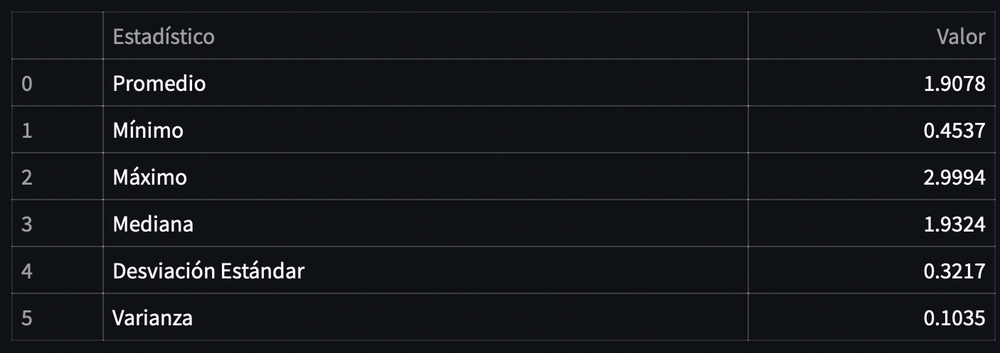
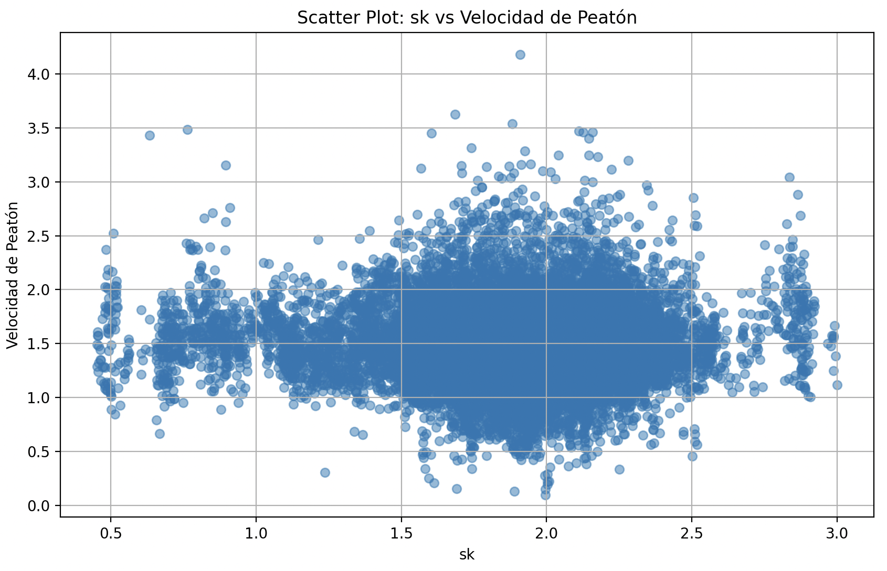
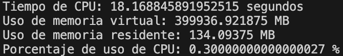

# Laboratorio 04: Cálculo de Sk

## 1. Introducción 

El presente trabajo se centra en determinar el valor del parámetro "sk" en el modelo de Weidmann, aplicado a la movilidad peatonal. Este modelo es fundamental para entender el comportamiento peatonal en entornos urbanos. Se busca evaluar la relación entre "sk" y las velocidades de los peatones, utilizando datos reales y técnicas de programación en Python. Esto proporciona una visión más profunda de la dinámica peatonal, lo que se puede traducir en mejoras en la planificación urbana en términos de seguridad y eficiencia peatonal.

### 1.1 Justificación
La relevancia de este trabajo radica en su enfoque de entender el comportamiento de peatones en un túnel. La seguridad peatonal en este entorno es de suma importancia debido a las restricciones de espacio y las posibles emergencias. Mediante el modelo de Weidmann y el análisis del parámetro "sk", se pueden diseñar estrategias de evacuación más efectivas y optimizar la infraestructura para promover un flujo seguro de los peatones. Además, esta investigación tiene potenciales aplicaciones en diversas disciplinas.
### 1.3 Objetivos 

**Objetivo General**

Desarrollar un programa en lenguaje Python que permita calcular el parámetro sk del modelo de Weidmann a partir de los datos proporcionados en un archivo de texto y visualizar la relación entre el sk y la velocidad real de los peatones de manera gráfica.

**Objetivos específicos**

1. Leer y cargar los datos referentes a peatones desde el archivo de texto en el programa.
2. Organizar la información en estructuras de datos adecuadas para su manipulación posterior.
3. Desarrollar algoritmos para calcular el parámetro sk, considerando la distancia y cantidad de peatones vecinos.
5. Optimizar y mejorar la eficiencia del programa en términos de uso de memoria y tiempo de ejecución.
6. Generar un scatter plot que represente el parámetro sk y las velocidades reales de los peatones registrados en el archivo de texto. 
7. Elaborar documentación detallada del programa, explicando su funcionamiento y los algoritmos utilizados.

## 2. Marco teórico
Para la realización del experimento se siguieron los pasos generales de la metodología ETL (Extracción, Transformación y Cargar).
El uso de lenguaje Python en Visual Studio permiten la manipulación eficiente de los datos, facilitando el calculo de sk y análisis posteriores.

**Python**: Es un lenguaje de programación ampliamente utilizado debido a su facil uso y amplia gama de bibliotecas. Su sintaxis clara y legible permite desarrollar programas eficientes.

**iPython**: Es un entorno interactivo para la programación en Python. Proporciona una interfaz enriquecida para la programación, depuración y visualización de datos.

**Numpy**: Ofrece estructuras de datos eficientes para trabajar con arreglos multidimensionales y funciones matemáticas de alto rendimiento.

**Visual Studio**: Es un entorno de desarrollo integrado ampliamente utilizado para programación en diversos lenguajes. Proporciona características avanzadas de edición de código, depuración y control de versiones.

**Pandas**: Ofrece estructuras de datos y herramientas para el análisis de datos. Su estructura principal, el DataFrame, se emplea para cargar y organizar los datos de peatones.

**Streamlit:**: Es un marco de desarrollo de código abierto que permite crear de manera sencilla aplicaciones web interactivas para la visualización y presentación de datos.

## 3. Materiales y métodos

Se utilizó un archivo de texto que contiene 25536 líneas de datos, los cuales registran el paso de 148 peatones a lo largo del tiempo en diferentes fotogramas dentro de un túnel. Estos datos incluyen el ID de cada persona, el número de fotograma "frame", y las coordenadas (x, y, z) de los peatones en metros (con decimales). Estos registros pueden resultar útiles para analizar el comportamiento de los peatones y llevar a cabo tareas de seguimiento y análisis de sus movimientos en el túnel.

1. Extracción: En primer lugar se lee el archivo del cual se extraen las coordenadas de los peatones, las cuales se entregan en la función main para realizar los distintos analisis requeridos.

2. Transformar:
   
   2.1. Creación del Data Frame: Se inicia el proceso creando un Data Frame que contiene los datos extraídos del archivo fuente. Este Data Frame se configura como una tabla en la que cada fila corresponde a la información de un peatón en un frame (imagen) específico.
   
   2.2. Cálculo de Velocidad Individual: Posteriormente, se procede a calcular la velocidad de cada peatón al moverse de un frame al siguiente. Esta velocidad se determina mediante el cálculo de la distancia que el peatón ha recorrido, considerando la variación entre sus coordenadas x e y en estos dos frames consecutivos.
   
   2.3. Cálculo de la distancia del peatón de interés con sus peatones vecinos: Este cálculo se efectúa mediante la función "calcular_distancia", la cual utiliza la fórmula de distancia Euclidiana. En la función "buscar_peatones_cercanos", se construye un árbol de búsqueda (KDTree) basado en las coordenadas de los peatones en un cuadro temporal específico. Para cada peatón en ese cuadro, se localizan los índices de sus vecinos cercanos dentro del radio establecido y se calculan las distancias utilizando "calcular_distancia". Las distancias se suman para medir la distancia total entre el peatón de interés y sus vecinos, finalmente esta información se almacena en el DataFrame.

   2.4. Cálculo del parámetro Sk: Despues de identificar los peatones cercanos, calcular las distancias entre el peatón y sus vecinos y obtener la distancia total. Se procede a calcular el parámetro Sk, dividiendo la distancia total entre el número de vecinos, esto representa la dispersión promedio de las distancias entre el peatón y sus vecinos. Este valor caracteriza cómo están distribuidos los peatones alrededor de un individuo en términos de distancia espacial.
   
   2.5. Análisis Estadístico: Para un análisis más profundo, se realiza el cálculo de la media y la desviación estándar del parámetro Sk. Estos valores estadísticos proporcionan información importante sobre la distribución y variabilidad del Sk.

3. Cargar:
   3.1. Generación de un Mapa de Calor: Empleando las funcionalidades ofrecidas por la biblioteca Pandas, se procede a crear un mapa de calor en forma de histograma 2D. Este mapa de calor proporciona una representación visual que revela las rutas más utilizadas por los peatones al cruzar el túnel. La utilización de esta herramienta permite identificar los puntos preferentes de travesía y brinda una comprensión intuitiva de los patrones de movimiento en el área en cuestión.

   3.2. Generación de un histograma: La función "hist_velocidad" genera un histograma que muestra cómo se distribuyen las velocidades de los peatones. Utiliza el DataFrame filtrado y el número de intervalos (bins) como argumentos, el número de Bins en el gráfico de velocidad corresponde a 50.
   
   3.3. Generación de un Scatter plot: Utilizando las herramientas disponibles en la librería Matplotlib, se construye un gráfico de dispersión de la interacción entre el parámetro Sk y la velocidad real de los peatones. El scatter plot presenta una visión gráfica de la relación entre estas dos métricas. Mediante la observación de la distribución de puntos en el gráfico, se puede distinguir cómo la dispersión espacial de los peatones influye en sus velocidades de movimiento.

Con esta combinación de funciones, es posible realizar un análisis completo del comportamiento de los peatones en el túnel, identificar patrones de movimiento, zonas de congestión y analizar cómo cambian estas tendencias a lo largo del tiempo o en diferentes secciones del túnel.

## 4. Resultados obtenidos
Después de seguir el procedimiento explicado anteriormente, utilizando la biblioteca Pandas se procede a analizar la movilidad peatonal, para visualizar el comportamiento de los peatones se realizó un Histograma 2D, utilizando 40 y 30 pixeles para los ejes x e y, respectivamente. Se considera un desplazamiento unidireccional de derecha a izquierda, es el mismo presentado anteriormente, con una persona parada en el centro de la puerta de ingreso, la cual tiene un ancho de un metro y una puerta de cinco metros para la salida, provocando así una concentración marcada de flujo a lo largo de las secciones laterales del túnel, mientras que el sector central ostenta un vacío relativo.

Histogrma de velocidad

Esatditicos Sk

Se elaboró un gráfico de dispersión que contrasta al parámetro Sk con la velocidad real de los peatones. Este gráfico ofrece valiosa información para el análisis del comportamiento peatonal. Nos permite entender cómo la dispersión espacial de los peatones se relaciona con sus velocidades, lo cual es fundamental para comprender los patrones de movimiento en una determinada área. Aunque se presentan valores atípicos, aparentemente se forman grupos conglomerados. Estos agrupamientos sugieren que no existe una relación lineal entre las variables. 

Finalmente, se ejecutó el código que permite obtener las métricas de funcionamiento del código, proporcionándo valiosas métricas de rendimiento. Estos resultados revelan que el programa tuvo un tiempo de CPU total de 18 segundos, mientras que su requerimiento de memoria virtual alcanzó los 399936.9218 MB. En términos de memoria residente, el programa utilizó 134.09375 MB. Además, el porcentaje de uso de la CPU se mantuvo en un bajo 0.3%, lo que sugiere que el programa operó con una carga mínima en la capacidad de procesamiento de la CPU en ese momento. Estos datos permiten una evaluación más profunda del comportamiento y la eficiencia del código en función de su impacto en los recursos del sistema.

## 5. Conclusiones

Este trabajo destaca la importancia del análisis del parámetro Sk del modelo de Weidmann en el contexto de la problemática peatonal en túneles. A través de la evaluación de este parámetro y la posterior creación del gráfico Sk vs. velocidad real, se ha logrado una comprensión más profunda de cómo los peatones se comportan en este entorno específico. Los resultados obtenidos no solo son relevantes para la planificación urbana y la seguridad peatonal en túneles, sino que también han demostrado la aplicabilidad de este enfoque en situaciones más amplias.

La identificación de las velocidades ha proporcionado una valiosa perspectiva sobre cómo se adaptan los peatones a las condiciones particulares de un túnel. Esto tiene implicaciones directas en la mejora de la fluidez y seguridad del flujo peatonal en estos espacios, abordando los retos específicos que los túneles presentan en términos de iluminación, diseño y evacuación.

Además de su relevancia en entornos subterráneos, la metodología aplicada en este estudio podría extenderse a otras áreas, como la planificación de eventos masivos, la evaluación de la infraestructura de transporte público y la seguridad en espacios de alta densidad de peatones. La generación de gráficos que relacionan el parámetro Sk con la velocidad real no solo proporciona claridad visual, sino que también permite tomar decisiones informadas y diseñar soluciones efectivas.

