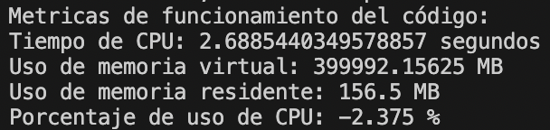

# Laboratorio 01: Cálculo de frecuencia peatonal 

## 1. Introducción 

**Definición** del problema
En el contexto actual de planificación urbana y seguridad peatonal, comprender los patrones de desplazamiento de peatones es esencial. La problemática a desarrollar en el presente trabajo consiste en calcular una matriz de frecuencia a partir de datos de puntos de peatones en un archivo de texto. El desarrollo de esta matriz mejora la identificación de zonas de riesgo y la toma de decisiones informadas. A través del uso Python como lenguaje de programación, se ofrece una solución para procesar grandes conjuntos de datos y calcular frecuencias, abordando esta problemática de manera eficiente.

### 1.1 Justificación
Este trabajo es fundamental ya que aborda la falta de herramientas automatizadas para analizar patrones de movimiento de peatones. La matriz de frecuencia obtenida a través de programación en Python permitirá una planificación urbana precisa, mejorando la seguridad y eficiencia en áreas de alto tránsito peatonal. Ante el crecimiento urbano, esta automatización se vuelve esencial para diseñar entornos más seguros y adaptados a las necesidades de los peatones.
### 1.3 Objetivos 

**Objetivo General**

Desarrollar un programa en lenguaje Python que permita calcular la matriz de frecuencia basada en los datos de peatones proporcionados por un archivo de texto.

**Objetivos específicos**

1. Leer y cargar los datos referentes a peatones desde el archivo de texto en el programa.
2. Organizar la información en estructuras de datos adecuadas para su manipulación posterior.
3. Elaborar documentación detallada del programa, explicando su funcionamiento y los algoritmos utilizados.

## 2. Marco teórico
Para la realización del experimento se siguieron los pasos generales de la metodología ETL (Extracción, Transformación y Cargar).
El uso de NumPy y el lenguaje Python en Visual Studio permiten la manipulación eficiente de los datos, facilitando los cálculos de frecuencia y análisis posteriores.

**Python**: Es un lenguaje de programación ampliamente utilizado en la ciencia de datos debido a su facilidad de uso y su amplia gama de librerías especializadas. Su sintaxis clara y legible permite desarrollar programas eficientes.

**iPython**: Es un entorno interactivo para la programación en Python, que permite ejecutar y depurar código. Proporciona una interfaz enriquecida para la programación, depuración y visualización de datos, lo que es especialmente útil para la experimentación y análisis iterativo.

**Numpy**: Ofrece estructuras de datos eficientes para trabajar con arreglos multidimensionales y funciones matemáticas de alto rendimiento. Esto es esencial para el análisis de datos masivos.

**Visual Studio**: Es un entorno de desarrollo integrado (IDE) muy popular y ampliamente utilizado para programación en diversos lenguajes, incluido Python. Proporciona características avanzadas de edición de código, depuración y control de versiones, lo que facilita el desarrollo y la colaboración en proyectos de programación científica.

## 3. Materiales y métodos

Se utilizó un archivo de texto que contiene 25536 líneas de datos, los cuales registran el paso de 148 peatones a lo largo del tiempo en diferentes fotogramas dentro de un túnel. Estos datos incluyen el ID de cada persona, el número de fotograma "frame", y las coordenadas (x, y, z) de los peatones en metros (con decimales). Estos registros pueden resultar útiles para analizar el comportamiento de los peatones y llevar a cabo tareas de seguimiento y análisis de sus movimientos en el túnel.

1. Extracción: En primer lugar se lee el archivo del cual se extraen las coordenadas de los peatones, las cuales se entregan en la función main para realizar los distintos analisis requeridos.

2. Transformar:
   2.1. Análisis de frecuencia de ejes X e Y: La función frecuencia_dict permite identificar qué valores en los ejes X e Y son los más frecuentes, lo que podría indicar direcciones o patrones de movimiento preferidos por los peatones.
   2.2. Análisis de frecuencia de coordenadas: La función frecuencia_xy puede ayudar a determinar qué coordenadas (x, y) se repiten con mayor frecuencia, lo que podría revelar áreas de mayor concentración de peatones.
   2.3 Conversión de coordenadas a píxeles: La función mts_pixel permite transformar las coordenadas en metros a píxeles, lo que puede ser útil para representar los datos de manera gráfica o para realizar análisis adicionales basados en píxeles.

4. Cargar:
   3.1. Creación de un mapa de calor: La matriz de calor generada con la función main permite visualizar la distribución espacial de los peatones en el túnel, mostrando las áreas con mayor densidad de paso.

Por último se hizo un analisis de la medición de recursos del sistema, para lo cual se utilizó La función get_resource_info proporciona información sobre el tiempo de CPU y el uso de memoria durante la ejecución del código, lo que puede ser valioso para evaluar el rendimiento y eficiencia del análisis en función de los recursos utilizados.

Con esta combinación de funciones, es posible realizar un análisis completo del comportamiento de los peatones en el túnel, identificar patrones de movimiento, zonas de congestión y analizar cómo cambian estas tendencias a lo largo del tiempo o en diferentes secciones del túnel. Además, el mapa de calor permitirá una visualización intuitiva de la densidad de peatones en diferentes áreas, lo que podría ayudar en la planificación y toma de decisiones relacionadas con el diseño y manejo del túnel.

## 4. Resultados obtenidos
Después de seguir el procedimiento explicado anteriormente, se llevó a cabo un análisis para identificar las coordenadas "X" e "Y" que se repitieron con mayor frecuencia, así como las intersecciones más frecuentes entre estas coordenadas. El objetivo principal fue visualizar las áreas por donde se desplazaban los peatones en el túnel.

Este análisis se realizó utilizando tanto los datos en metros como en píxeles. Es importante tener en cuenta que, al convertir los datos a píxeles, se realizaron aproximaciones, lo que resultó en un aumento de las frecuencias observadas.

Este enfoque de análisis permitió obtener una representación más clara y visual de los patrones de movimiento de los peatones en el túnel. Las áreas de mayor concentración de peatones y las rutas más transitadas quedaron resaltadas por colores más claros en el mapa de calor, lo que facilita la identificación de tendencias y comportamientos relevantes para el estudio del flujo de personas en el área analizada.

Por último, se calcularon las métricas de rendimiento del sistema, para lo cual se mide el uso de recursos (CPU y Memoria) y como se puede observar son bastante reducidos, por lo cual el código se encuentra optimizado.

## 5. Conclusiones
El desarrollo de este trabajo  ha demostrado la relevancia de aplicar herramientas computacionales como Python, IPython, NumPy y Visual Studio Code en el análisis de patrones de movimiento de peatones en un túnel. La identificación de las coordenadas x e y que más se repiten en el archivo de datos proporciona información crucial para comprender los puntos de mayor concentración y tránsito peatonal.

La construcción de un mapa de calor resalta visualmente las zonas de mayor afluencia, permitiendo una interpretación intuitiva de la distribución de peatones en el túnel. Esta representación gráfica proporciona una visión clara de las áreas críticas que pueden requerir atención en términos de seguridad, diseño y planificación urbana.

En la vida real, este experimento podría influir en la optimización del diseño de túneles y pasillos, permitiendo a los planificadores urbanos mejorar la distribución de los espacios peatonales y garantizar una circulación más fluida y segura. Además, los datos obtenidos podrían ayudar a la implementación de medidas de seguridad y señalización en áreas de alto tránsito, reduciendo el riesgo de accidentes y garantizando un ambiente más seguro para los peatones. Por otra parte, el experimento descrito ofrece una herramienta poderosa y flexible para explorar y comprender fenómenos en diversas áreas, desde la ecología y biología hasta la ingeniería y la gestión ambiental. Al aprovechar la información que proporcionan las coordenadas y la representación gráfica mediante mapas de calor, se abre la puerta a un análisis más profundo y detallado de procesos naturales y sistemas artificiales, lo que contribuye a un mejor conocimiento y uso sostenible de nuestro entorno.

