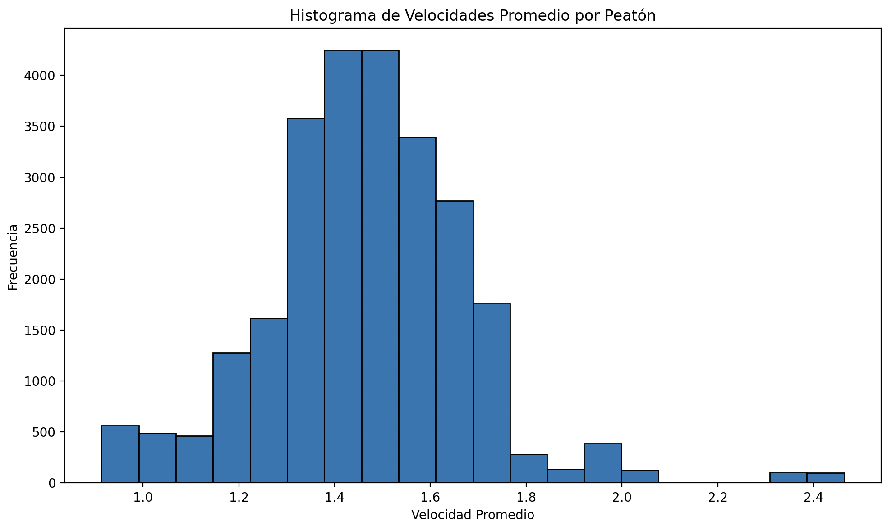
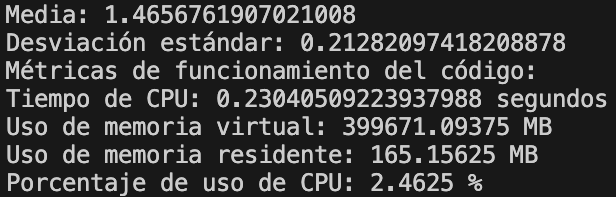

# Laboratorio 03: Velocidad de peatones

## 1. Introducción 

En el contexto actual de planificación urbana y seguridad peatonal, comprender los patrones de desplazamiento de peatones es esencial. La problemática a desarrollar en el presente trabajo consiste en calcular la velocidad de los peatones a partir de los datos entregados en un archivo de texto. Conocer la velocidad de los peatones, permite dimensionar correctamente los espacios y aumentar la seguridad peatonal. A través del uso Python como lenguaje de programación, se ofrece una solución eficiente para procesar grandes conjuntos de datos.

### 1.1 Justificación
Este trabajo es fundamental ya que aborda la falta de herramientas automatizadas para analizar el movimiento de peatones. Conocer las velocidades a las que se desplazan los peatones permite diseñar espacios eficientes y seguros, optimizando la movilidad y minimizando riesgos de accidentes. Calcular y visualizar las velocidades promedio de los peatones, provee a los planificadores y autoridades una base sólida para tomar decisiones informadas en la gestión del tráfico, diseño de infraestructuras y políticas de seguridad vial. Es importante destacar que el análisis del flujo de peatones tiene aplicaciones potenciales en diversas áreas de investigación.
### 1.3 Objetivos 

**Objetivo General**

Desarrollar un programa en lenguaje Python que permita calcular la velocidad de los peatones a partir de los datos proporcionados en un archivo de texto y visualizar las velocidades promedios de todos los peatones de manera gráfica.

**Objetivos específicos**

1. Leer y cargar los datos referentes a peatones desde el archivo de texto en el programa.
2. Organizar la información en estructuras de datos adecuadas para su manipulación posterior.
3. Desarrollar algoritmos para calcular la velocidad de cada peatón, considerando la distancia recorrida y el tiempo transcurrido.
5. Optimizar y mejorar la eficiencia del programa en términos de uso de memoria y tiempo de ejecución.
6. Generar un histograma que represente las velocidades promedio de todos los peatones registrados en el archivo de datos. 
7. Elaborar documentación detallada del programa, explicando su funcionamiento y los algoritmos utilizados.

## 2. Marco teórico
Para la realización del experimento se siguieron los pasos generales de la metodología ETL (Extracción, Transformación y Cargar).
El uso de NumPy y el lenguaje Python en Visual Studio permiten la manipulación eficiente de los datos, facilitando los cálculos de frecuencia y análisis posteriores.

**Python**: Es un lenguaje de programación ampliamente utilizado en la ciencia de datos debido a su facilidad de uso y su amplia gama de bibliotecas especializadas. Su sintaxis clara y legible permite desarrollar programas eficientes.

**iPython**: Es un entorno interactivo para la programación en Python, que permite ejecutar y depurar código. Proporciona una interfaz enriquecida para la programación, depuración y visualización de datos, lo que es especialmente útil para la experimentación y análisis iterativo.

**Numpy**: Ofrece estructuras de datos eficientes para trabajar con arreglos multidimensionales y funciones matemáticas de alto rendimiento. Esto es esencial para el análisis de datos masivos.

**Visual Studio**: Es un entorno de desarrollo integrado (IDE) muy popular y ampliamente utilizado para programación en diversos lenguajes, incluido Python. Proporciona características avanzadas de edición de código, depuración y control de versiones, lo que facilita el desarrollo y la colaboración en proyectos de programación científica.

**Pandas**: Ofrece estructuras de datos y herramientas para el análisis de datos. Su estructura principal, el DataFrame, se emplea para cargar y organizar los datos de peatones. Esto permite la manipulación y transformación de los datos.

## 3. Materiales y métodos

Se utilizó un archivo de texto que contiene 25536 líneas de datos, los cuales registran el paso de 148 peatones a lo largo del tiempo en diferentes fotogramas dentro de un túnel. Estos datos incluyen el ID de cada persona, el número de fotograma "frame", y las coordenadas (x, y, z) de los peatones en metros (con decimales). Estos registros pueden resultar útiles para analizar el comportamiento de los peatones y llevar a cabo tareas de seguimiento y análisis de sus movimientos en el túnel.

1. Extracción: En primer lugar se lee el archivo del cual se extraen las coordenadas de los peatones, las cuales se entregan en la función main para realizar los distintos analisis requeridos.

2. Transformar:
   
   2.1. Creación del Data Frame: Se inicia el proceso creando un Data Frame que contiene los datos extraídos del archivo fuente. Este Data Frame se configura como una tabla en la que cada fila corresponde a la información de un peatón en un frame (imagen) específico.
   
   2.2. Cálculo de Velocidad Individual: Posteriormente, se procede a calcular la velocidad de cada peatón al moverse de un frame al siguiente. Esta velocidad se determina mediante el cálculo de la distancia que el peatón ha recorrido, considerando la variación entre sus coordenadas x e y en estos dos frames consecutivos.
   
   2.3. Cálculo de Velocidad Promedio: Una vez obtenidas las velocidades individuales, se procede al cálculo de la velocidad promedio para cada peatón. Esto implica la determinación de la media de las velocidades individuales del peatón a lo largo de su recorrido.
   
   2.4. Análisis Estadístico: Para un análisis más profundo, se realiza el cálculo de la media y la desviación estándar de las velocidades promedio de todos los peatones en el conjunto de datos. Estos valores estadísticos proporcionan información importante sobre la distribución y variabilidad de las velocidades entre los diferentes peatones observados.

3. Cargar:
   3.1. Generación de un Mapa de Calor: Empleando las funcionalidades ofrecidas por la biblioteca Pandas, se procede a crear un mapa de calor en forma de histograma 2D. Este mapa de calor proporciona una representación visual que revela las rutas más utilizadas por los peatones al cruzar el túnel. La utilización de esta herramienta permite identificar los puntos preferentes de travesía y brinda una comprensión intuitiva de los patrones de movimiento en el área en cuestión.

Con esta combinación de funciones, es posible realizar un análisis completo del comportamiento de los peatones en el túnel, identificar patrones de movimiento, zonas de congestión y analizar cómo cambian estas tendencias a lo largo del tiempo o en diferentes secciones del túnel. Además, el mapa de calor permitirá una visualización intuitiva de la densidad de peatones en diferentes áreas, lo que podría ayudar en la planificación y toma de decisiones relacionadas con el diseño y manejo del túnel.

## 4. Resultados obtenidos
Después de seguir el procedimiento explicado anteriormente, utilizando la biblioteca Pandas se procede a analizar la movilidad peatonal, para visualizar el comportamiento de los peatones se realizó un Histograma 2D, utilizando 40 y 30 pixeles para los ejes x e y, respectivamente. Se considera un desplazamiento unidireccional de derecha a izquierda, es el mismo presentado anteriormente, con una persona parada en el centro de la puerta de ingreso, la cual tiene un ancho de un metro y una puerta de cinco metros para la salida, provocando así una concentración marcada de flujo a lo largo de las secciones laterales del túnel, mientras que el sector central ostenta un vacío relativo.

Se procedió con el cálculo de las velocidades de los peatones, seguido de la representación gráfica de sus promedios. Esta visualización reveló una distribución normal en las velocidades promedio, con un ligero sesgo positivo.

En la etapa final del análisis, se determinaron la media y la desviación estándar de las velocidades promedio de los peatones, arrojando valores aproximados de 1.4657 y 0.2128, respectivamente. Estos resultados permiten la realización de análisis posteriores. Por ejemplo, mediante simulaciones, es posible generar variables aleatorias para modelar el comportamiento y evaluar posibles cambios. Estos análisis se desarrollarían tomando en cuenta las condiciones iniciales previamente expuestas, como el tamaño de la puerta de entrada y salida.

## 5. Conclusiones

Este trabajo ha demostrado la importancia de identificar las velocidades a las que se desplazan los peatones en entornos urbanos, especialmente en contextos como túneles. La información obtenida a través de la herramienta desarrollada proporciona una base sólida para abordar eficazmente desafíos relacionados con la planificación urbana y la seguridad peatonal. La identificación de velocidades en un túnel es especialmente relevante, ya que estos espacios suelen presentar desafíos únicos en términos de flujo de tráfico, iluminación y seguridad. Tener datos precisos sobre las velocidades promedio de los peatones en este contexto permite ajustar las condiciones del túnel para garantizar un flujo seguro y eficiente.

Además de su aplicación en túneles, un programa que calcule la velocidad de manera similar podría tener múltiples usos en diferentes escenarios. Por ejemplo, en el ámbito de los deportes y el rendimiento físico, podría utilizarse para medir la velocidad de corredores o ciclistas en pistas de entrenamiento. En la industria de la logística y el transporte, podría aplicarse para rastrear la velocidad de vehículos en rutas de entrega. En entornos académicos o de investigación, este tipo de programa podría utilizarse para analizar el movimiento de animales en estudios de ecología.

La importancia de visualizar gráficamente los datos radica en su capacidad para proporcionar una representación clara y concisa de la distribución de las velocidades. La visualización de estos en un histograma proporciona información valiosa para comprender la variabilidad en las velocidades y tomar decisiones informadas para la planificación y la seguridad. Al entender las velocidades de los peatones y otros elementos móviles, podemos diseñar entornos más seguros, eficientes y adaptados a las necesidades de las personas, promoviendo una mejor calidad de vida y una movilidad más sostenible en nuestras ciudades.

