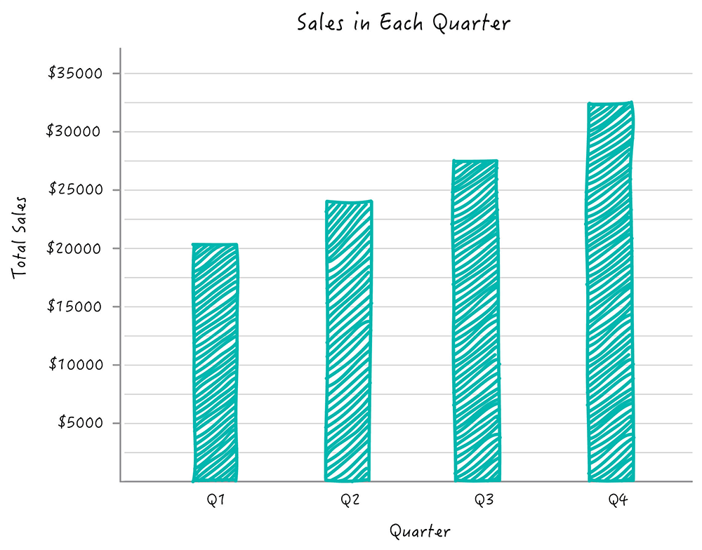

# Laboratorio 01: Cálculo de frecuencia peatonal 

## 1. Introducción 

**Definición** del problema
En el contexto actual de planificación urbana y seguridad peatonal, comprender los patrones de desplazamiento de peatones es esencial. La problemática a desarrollar en el presente trabajo consiste en calcular una matriz de frecuencia a partir de datos de puntos de peatones en un archivo de texto. El desarrollo de esta matriz mejora la identificación de zonas de riesgo y la toma de decisiones informadas. A través del uso Python como lenguaje de programación, se ofrece una solución para procesar grandes conjuntos de datos y calcular frecuencias, abordando esta problemática de manera eficiente.

### 1.1 Justificación
Este trabajo es fundamental ya que aborda la falta de herramientas automatizadas para analizar patrones de movimiento de peatones. La matriz de frecuencia obtenida a través de programación científica en Python permitirá una planificación urbana precisa, mejorando la seguridad y eficiencia en áreas de alto tránsito peatonal. Ante el crecimiento urbano, esta automatización se vuelve esencial para diseñar entornos más seguros y adaptados a las necesidades de los peatones.
### 1.3 Objetivos 

**Objetivo General**

Desarrollar un programa en lenguaje Python que permita calcular la matriz de frecuencia basada en los datos de peatones proporcionados por un archivo de texto.

**Objetivos específicos**

1. Leer y cargar los datos referentes a peatones desde el archivo de texto en el programa.
2. Organizar la información en estructuras de datos adecuadas para su manipulación posterior.
3. Elaborar documentación detallada del programa, explicando su funcionamiento y los algoritmos utilizados.

## 2. Marco teórico
El uso de NumPy y el lenguaje Python en Visual Studio permiten la manipulación eficiente de los datos, facilitando los cálculos de frecuencia y análisis posteriores.

**Python**: Es un lenguaje de programación ampliamente utilizado en la ciencia de datos debido a su facilidad de uso y su amplia gama de librerías especializadas. Su sintaxis clara y legible permite desarrollar programas eficientes.

**iPython**: Es un entorno interactivo para la programación en Python, que permite ejecutar y depurar código. Proporciona una interfaz enriquecida para la programación, depuración y visualización de datos, lo que es especialmente útil para la experimentación y análisis iterativo.

**Numpy**: Ofrece estructuras de datos eficientes para trabajar con arreglos multidimensionales y funciones matemáticas de alto rendimiento. Esto es esencial para el análisis de datos masivos.

**Visual Studio**: Es un entorno de desarrollo integrado (IDE) muy popular y ampliamente utilizado para programación en diversos lenguajes, incluido Python. Proporciona características avanzadas de edición de código, depuración y control de versiones, lo que facilita el desarrollo y la colaboración en proyectos de programación científica.

## 3. Materiales y métodos

Describir los elementos que se usarán en el laboratorio (dataset, tamaño, que tipo de datos tiene)
Describir como se realizará el laboratorio, la secuencia de pasos, y describir el experimento.

## 4. Resultados obtenidos

Indicar si el funcionamiento es correcto, agregar métricas de rendimiento como tiempo de ejecución y cantidad de memoria utilizada.

| Tipo de Experimento   | Tiempo de ejecucion (mseg) |  Memoria utilizada (Mb) |
|-----------------------|----------------------------|-------------------------|
| Programa Uno (p01.py) |                            |                         |
| Programa Dos (p02.py) |                            |                         |

## 5. Conclusiones

Apartir de los resultados inferir nuevo conocimiento. Por ejemplo, al ultilizar concatenación de listas cono "+" el programa es menos eficiente en términos de tiempo que utilizar 'append()'.

