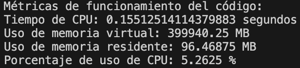

# Laboratorio 02: Visualización de mapas de calor

## 1. Introducción 

**Definición del problema**
En el contexto actual de planificación urbana y seguridad peatonal, comprender los patrones de desplazamiento de peatones es esencial. La problemática a desarrollar en el presente trabajo consiste en calcular una matriz de frecuencia a partir de datos de puntos de peatones en un archivo de texto. El desarrollo de esta matriz mejora la identificación de zonas de riesgo y la toma de decisiones informadas. A través del uso Python como lenguaje de programación, se ofrece una solución para procesar grandes conjuntos de datos y calcular frecuencias, abordando esta problemática de manera eficiente.

### 1.1 Justificación
Este trabajo es fundamental ya que aborda la falta de herramientas automatizadas para analizar patrones de movimiento de peatones. La matriz de frecuencia obtenida a través de programación en Python permitirá una planificación urbana precisa, mejorando la seguridad y eficiencia en áreas de alto tránsito peatonal. Ante el crecimiento urbano, esta automatización se vuelve esencial para diseñar entornos más seguros y adaptados a las necesidades de los peatones. Es importante destacar que el análisis del flujo de peatones tiene aplicaciones potenciales en diversas áreas de investigación.
### 1.3 Objetivos 

**Objetivo General**

Desarrollar un programa en lenguaje Python que permita visualizar le movimiento de peatones al pasar por un túnel, en base a los datos proporcionados por un archivo de texto.

**Objetivos específicos**

1. Leer y cargar los datos referentes a peatones desde el archivo de texto en el programa.
2. Organizar la información en estructuras de datos adecuadas para su manipulación posterior.
3. Optimizar y mejorar la eficiencia del programa en términos de uso de memoria y tiempo de ejecución.
4. Implementar un mecanismo de generación de un mapa de calor utilizando la matriz de frecuencia calculada. 
5. Elaborar documentación detallada del programa, explicando su funcionamiento y los algoritmos utilizados.

## 2. Marco teórico
Para la realización del experimento se siguieron los pasos generales de la metodología ETL (Extracción, Transformación y Cargar).
El uso de NumPy y el lenguaje Python en Visual Studio permiten la manipulación eficiente de los datos, facilitando los cálculos de frecuencia y análisis posteriores.

**Python**: Es un lenguaje de programación ampliamente utilizado en la ciencia de datos debido a su facilidad de uso y su amplia gama de librerías especializadas. Su sintaxis clara y legible permite desarrollar programas eficientes.

**iPython**: Es un entorno interactivo para la programación en Python, que permite ejecutar y depurar código. Proporciona una interfaz enriquecida para la programación, depuración y visualización de datos, lo que es especialmente útil para la experimentación y análisis iterativo.

**Numpy**: Ofrece estructuras de datos eficientes para trabajar con arreglos multidimensionales y funciones matemáticas de alto rendimiento. Esto es esencial para el análisis de datos masivos.

**Visual Studio**: Es un entorno de desarrollo integrado (IDE) muy popular y ampliamente utilizado para programación en diversos lenguajes, incluido Python. Proporciona características avanzadas de edición de código, depuración y control de versiones, lo que facilita el desarrollo y la colaboración en proyectos de programación científica.

**Pandas**: Ofrece estructuras de datos y herramientas para el análisis de datos. Su estructura principal, el DataFrame, se emplea para cargar y organizar los datos de peatones. Esto permite la manipulación y transformación de los datos.

## 3. Materiales y métodos

Se utilizó un archivo de texto que contiene 25536 líneas de datos, los cuales registran el paso de 148 peatones a lo largo del tiempo en diferentes fotogramas dentro de un túnel. Estos datos incluyen el ID de cada persona, el número de fotograma "frame", y las coordenadas (x, y, z) de los peatones en metros (con decimales). Estos registros pueden resultar útiles para analizar el comportamiento de los peatones y llevar a cabo tareas de seguimiento y análisis de sus movimientos en el túnel.

1. Extracción: En primer lugar se lee el archivo del cual se extraen las coordenadas de los peatones, las cuales se entregan en la función main para realizar los distintos analisis requeridos.

2. Transformar:
   2.1. Análisis de frecuencia de ejes X e Y: La función frecuencia_dict permite identificar qué valores en los ejes X e Y son los más frecuentes, lo que podría indicar direcciones o patrones de movimiento preferidos por los peatones.
   2.2. Análisis de frecuencia de coordenadas: La función frecuencia_xy puede ayudar a determinar qué coordenadas (x, y) se repiten con mayor frecuencia, lo que podría revelar áreas de mayor concentración de peatones.
   2.3 Conversión de coordenadas a píxeles: La función mts_pixel permite transformar las coordenadas en metros a píxeles, lo que puede ser útil para representar los datos de manera gráfica o para realizar análisis adicionales basados en píxeles.

4. Cargar:
   3.1. Creación de un mapa de calor: La matriz de calor generada con la función main permite visualizar la distribución espacial de los peatones en el túnel, mostrando las áreas con mayor densidad de paso.

Por otra parte, se realizó la creación del mapa de calor con la biblioteca Pandas, con la cual se hizó una comparación de los recursos del sistema, utilizando la función get_resource_info proporciona información sobre el tiempo de CPU y el uso de memoria durante la ejecución del código, lo que puede ser valioso para evaluar el rendimiento y eficiencia del análisis en función de los recursos utilizados.

Con esta combinación de funciones, es posible realizar un análisis completo del comportamiento de los peatones en el túnel, identificar patrones de movimiento, zonas de congestión y analizar cómo cambian estas tendencias a lo largo del tiempo o en diferentes secciones del túnel. Además, el mapa de calor permitirá una visualización intuitiva de la densidad de peatones en diferentes áreas, lo que podría ayudar en la planificación y toma de decisiones relacionadas con el diseño y manejo del túnel.

## 4. Resultados obtenidos
Después de seguir el procedimiento explicado anteriormente, se llevó a cabo un análisis para identificar las coordenadas "X" e "Y" que se repitieron con mayor frecuencia, así como las intersecciones más frecuentes entre estas coordenadas. El objetivo principal fue visualizar las áreas por donde se desplazaban los peatones en el túnel.

Este análisis se realizó utilizando tanto los datos en metros como en píxeles. Es importante tener en cuenta que, al convertir los datos a píxeles, se realizaron aproximaciones, lo que resultó en un aumento de las frecuencias observadas.

Este enfoque del análisis permitió obtener una representación más clara y visual de los patrones de movimiento de los peatones en el túnel. Las áreas con mayor concentración de peatones y las rutas más transitadas quedaron resaltadas por colores más claros en el mapa de calor, lo que facilita la identificación de tendencias y comportamientos relevantes para el estudio del flujo de personas en el área analizada.

Por último, se calcularon las métricas de rendimiento del sistema para ambos códigos, con lo cual se mide el uso de recursos (CPU y Memoria). Los resultados indican una notable eficiencia, evidenciando una cuidadosa optimización del código. No obstante, es relevante señalar que al emplear la librería "Pandas" se logra una mejora temporal de aproximadamente 0.05 segundos, agilizando la ejecución. Además, se destaca la notable concisión del código al emplear la estructura de "Data Frames" en lugar de matrices, lo cual no solo simplifica el código, sino que también incrementa su legibilidad y comprensión.

Empleando la biblioteca "Pandas", se procede al análisis de tres escenarios que abordan la movilidad peatonal. Estos casos consideran un desplazamiento unidireccional de derecha a izquierda, el primer caso es el mismo presentado anteriormente, con una persona parada en el centro de la puerta de ingreso, la cual tiene un ancho de un metro y una puerta de cinco metros para la salida, provocando así una concentración marcada de flujo a lo largo de las secciones laterales del túnel, mientras que el sector central ostenta un vacío relativo.

En el segundo caso, relativo a una entrada con una extensión de cuatro metros y una salida de cinco metros, es evidente la utilización integral del túnel por parte de los peatones. No se aprecia una preferencia marcada por un sendero con mayor repetición de tránsito. En su mayoría, los peatones transitan en línea prácticamente recta hasta alcanzar el extremo final. Aquellos se encuentran en los extremos laterales del túnel tienen que ir hacia el centro a medida que se acercan a la salida, esto se puede evidenciar en la franja amarilla superior.

## 5. Conclusiones
Este trabajo demuestra la importancia de utilizar herramientas computacionales como Python, NumPy, Visual Studio Code y la librería Pandas para analizar patrones de movimiento de peatones en un túnel. La identificación de coordenadas repetidas proporciona información clave sobre las zonas de mayor concentración y tráfico peatonal. La creación de mapas de calor resalta visualmente las áreas de mayor afluencia, lo que facilita la comprensión intuitiva de la distribución de peatones en el túnel.

La inclusión de la librería Pandas permitió crear histogramas de diferentes tipos de datos de manera más eficiente y con un código más conciso. Reducir la longitud del código y aumentar la eficiencia computacional es beneficioso por varias razones. Un código más eficiente implica un menor consumo de recursos computacionales, como tiempo de procesamiento y memoria. Esto es especialmente importante cuando se manejan conjuntos de datos extensos o cálculos complejos, como en el análisis de patrones de movimiento. Además, generalmente se ejecuta más rápido, lo que es crucial en aplicaciones en tiempo real o cuando se trabaja con grandes volúmenes de datos.

Este enfoque tiene implicaciones prácticas en la optimización del diseño de túneles y pasillos, permitiendo una planificación urbana más eficiente y segura. Los datos recopilados también pueden influir en la implementación de medidas de seguridad y señalización en áreas de alto tránsito, lo que reduce los riesgos de accidentes y mejora la seguridad peatonal.

La selección entre túneles estrechos o amplios depende de varios factores cruciales. En escenarios donde se requiera un flujo predominantemente unidireccional y la capacidad no sea una prioridad, los túneles estrechos podrían ser adecuados. Por otro lado, en situaciones que involucren flujos diversos y elevados volúmenes de peatones, como en zonas urbanas densamente pobladas o estaciones de transporte, los túneles amplios serían más apropiados para mantener una distribución uniforme, evitar aglomeraciones y garantizar la seguridad.

Además, este experimento ofrece una herramienta versátil para explorar fenómenos en diversas áreas, desde ecología hasta ingeniería. Al aprovechar la información de coordenadas y los mapas de calor, se posibilita un análisis más profundo de procesos naturales y sistemas artificiales, contribuyendo a un mejor conocimiento y uso sostenible del entorno.

